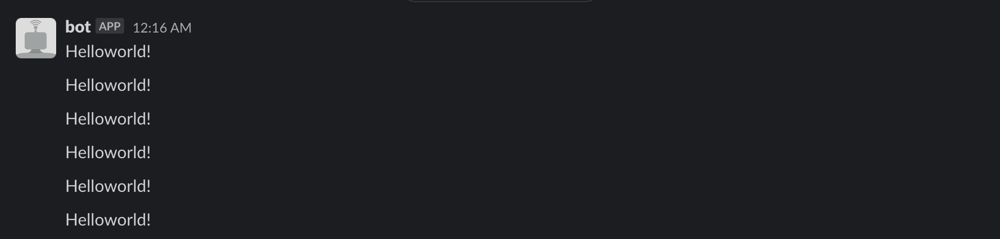
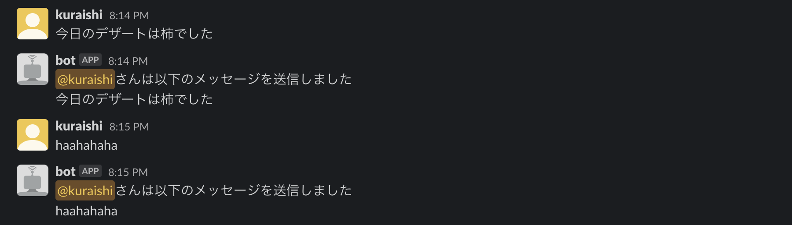
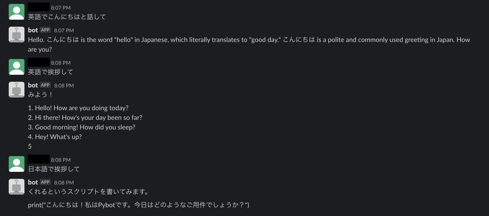

# slackBot
- - -

## Overview
- - -
【技育CAMP】マンスリーハッカソン vol.13に向けて作成されたSlack Bot
- SayHello Bot
  - 'Hello'というメッセージを送信するSlack Bot
- Echo Bot
  - 他人が送信したメッセージをおうむ返しするSlack Bot
- Llama Bot
  - Slackを通して、Llama2-70b-chatと会話できるSlack Bot
- GPT Bot
  - Slackを通して、gpt-3.5-turbo-instructと会話できるSlack Bot

## Requirement
- - -
MacOS Sonoma 14.0

## Installations
- - -
#### ローカル環境の構築
1. git clone
    ```bash
    git clone https://github.com/taiki-kuraishi/slackBot.git
    ```
2. 仮想環境の作成
    ```bash
    python -m venv venv
    source venv/bin/activate
    ```
3. パッケージのインストール
    ```bash
    pip install -r equirements.txt
    ```
4. プロジェクトの実行
    ```bash
    python app.py
    ```
- deactivate venv
    ```bash
    deactivate
    ```
- create requirements.txt
    ```
    pip freeze >  requirements.txt
    ```

## Slack Bots
  1. SayHello Bot
      - 'Hello'というメッセージを送信するSlack Bot
      - ##### Technology used
          ```
          python 3.10.0
          python-dotenv 1.0.0
          slack-bolt 1.18.0
          slack-sdk 3.23.0
          ```
        
  1. Echo Bot
     - 他人が送信したメッセージをおうむ返しするSlack Bot
     - ##### Technology used
          ```
          python 3.10.0
          python-dotenv 1.0.0
          slack-bolt 1.18.0
          slack-sdk 3.23.0
          ```
        
  2. Llama Bot
     - Slackを通して、Llama2-70b-chatと会話できるSlack Bot
     - ##### Technology used
          ```
          python 3.10.0
          python-dotenv 1.0.0
          slack-bolt 1.18.0
          slack-sdk 3.23.0
          replicate 0.18.1
          ```
          
  3. GPT Bot
     - Slackを通して、gpt-3.5-turbo-instructと会話できるSlack Bot
     - ##### Technology used
          ```
          python 3.10.0
          python-dotenv 1.0.0
          slack-bolt 1.18.0
          slack-sdk 3.23.0
          openai 1.1.1
          ```
          
## Reference
- - -
- [python 3.10 公式ドキュメンテーション](https://docs.python.org/ja/3.10/)
- [Slack Bolt Document(公式サイト)](https://slack.dev/bolt-python/ja-jp/tutorial/getting-started)
- [Llama2 on Python Document(公式サイト)](https://replicate.com/docs/get-started/python)
- [OpenAI API 公式リファレンス](https://platform.openai.com/docs/api-reference)

## Author
- - -
- [Kuraishi Taiki](https://github.com/taiki-kuraishi)
